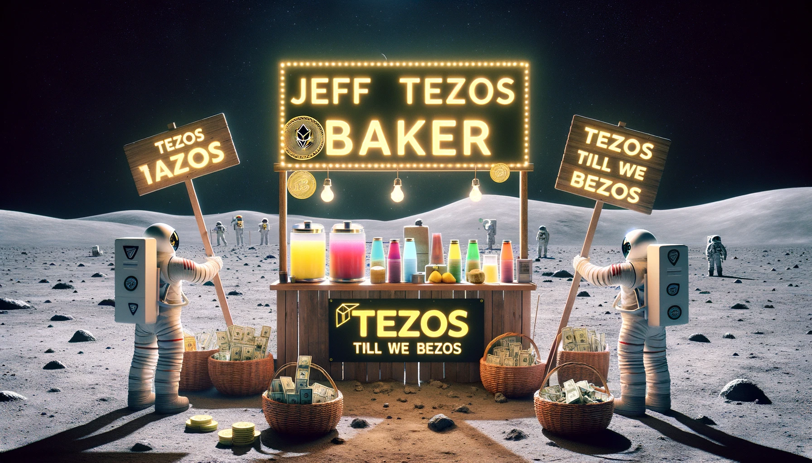

## Launch Jeff Tezos Baking Node

During 2020 the engineers of JT Labs realized the potential and invitable future of baking to eclipse proof of worok mechanisms. They went to work!

### Tezos Till We Bezos

- **Technical Analysis:** Understanding the ability to create nodes required a barier to entry low enough average users could build and maintain nodes.

- **Result:** Created multiple delegate nodes opperating above 99%, giving all contibutors an average of 8.7% return on capital 
