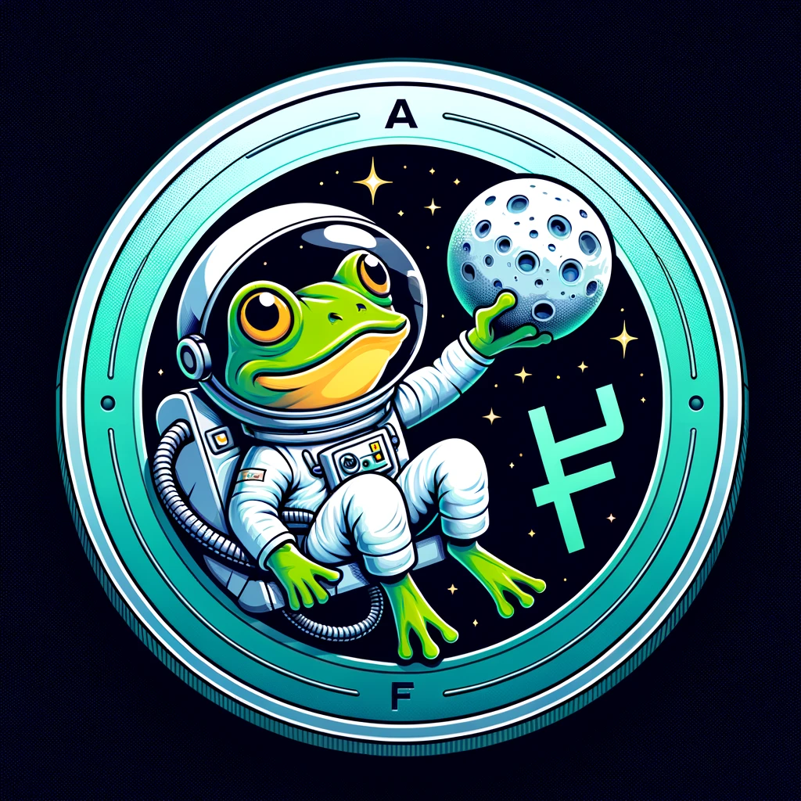

## Introducing AstroFrogs | [Jump In](https://www.astrofrog.lol/)

JT Labs jumps into the pond of meme coin framework creation, building a revolutionary project AstroFrogs to perfect meme coin deployment and develoment.

- **Fully Renounced:** We're thrilled to introduce NebulaSync 2.0, our revamped file synchronization tool. It now offers blazing-fast sync speeds, improved reliability, and enhanced cross-device compatibility.

- **Meme Genuises:** Because we needed to say it one more time

- **Characters:** 

  -**[Neil Frogstrong](https://www.astrofrog.lol/hall-of-fame/neil-frogstrong)**: Commander / Hopper: Neil Frogstrong was a tadpole with a dream that reached beyond the stars. 

  -**[Buzz Al-slurpn](https://www.astrofrog.lol/hall-of-fame/buzz-al-slurpn)**: Pilot: From Pond to Moon Dust, Hopping onto History. 

  -**[Rippit Signaler](https://www.astrofrog.lol/hall-of-fame/rippit-signaler)**: General / Heighten Foresight: Charting the Course, Connecting the Cosmos.

  -**[Luna Hopper](https://www.astrofrog.lol/hall-of-fame/luna-hopper)** Chief Pilot / Quick Witt: Dreaming high, leaping higher.

